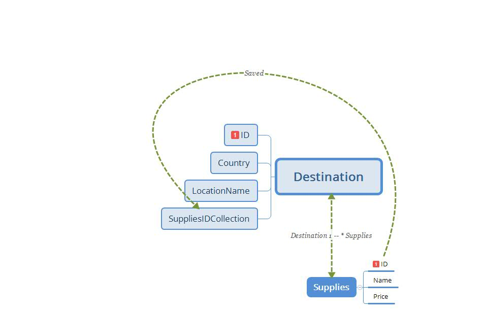

## ReadMe
- Your readme should include the following information:
	- How long did it take you to complete this assignment?
		- I dunno, a couple hours, if you include planning and design work for the tables
	- What did you struggle with? Why? How did you solve?
		- Motivation, because this lab didn't really hook me. Just kind of powered through as much as I could.
	- What did you learn during this assignment?
		- I learned that planning table interactions ahead of time can save time, but is also tedious and exhausting.
    - What resources did you utilize for this assignment?
		- Class Demo and the docs.

